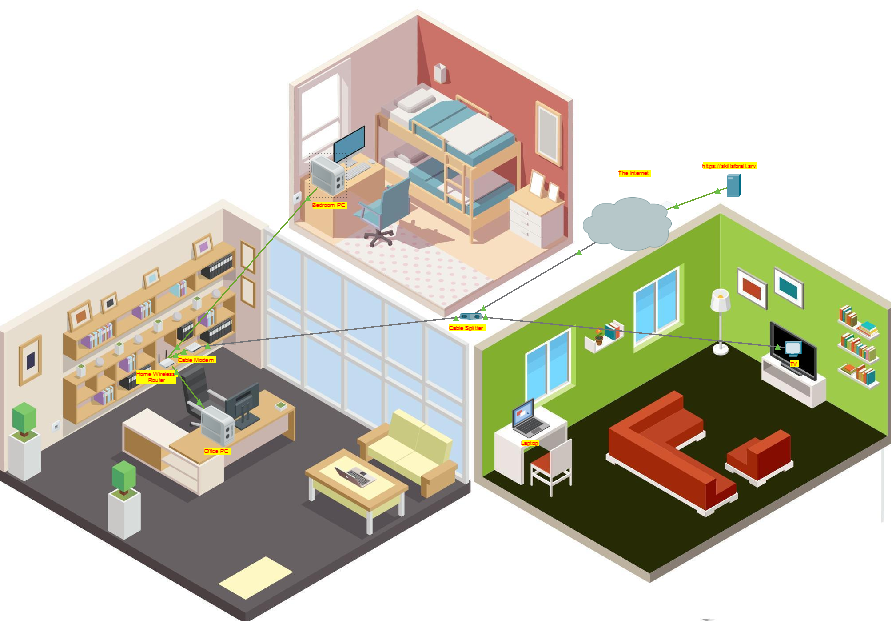

# 🏠 Rede Doméstica – Cisco Packet Tracer

Este repositório contém um exercício de **configuração básica de rede doméstica**, desenvolvido utilizando o **Cisco Packet Tracer**, com foco em fundamentos de redes e conectividade.

## 📌 Objetivo
Simular uma rede doméstica funcional, conectando diferentes dispositivos a partir de um roteador, permitindo acesso à internet e comunicação local.

## 🧩 Topologia da Rede
A rede é composta por:
- Roteador doméstico
- Switch
- PCs
- Notebook
- Dispositivos conectados via cabo Ethernet

## ⚙️ Configurações realizadas
- Configuração básica de endereçamento IP
- Conexão dos dispositivos via switch e roteador
- Simulação de acesso à internet
- Organização lógica da rede doméstica

## 🛠️ Ferramentas utilizadas
- Cisco Packet Tracer

## 📁 Arquivos
- `packet-tracer/rede_domestica.pkt`: arquivo do projeto no Packet Tracer
- `imagens/`: imagens da topologia da rede

## 🚀 Autor
Caio Cesar
